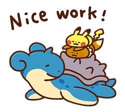

# Object Master
<aside align="center">

<span align="center">  </span>

**💡 Some data we encounter will be immutable, meaning we can not modify it in place. 
Using `map()`, `filter()`, and `forEach()`, create new arrays 💪**

</aside>

-----
### Tags: 
- callback functions
- higher order functions
- immutable objects
  
### Objectives: 
- Analyze the concept of functions as first-class citizens in JavaScript.
- Apply callback functions in JavaScript, Differentiate and utilize array methods such as .map() .filter() and .forEach
- Use the structure of existing data to perform operations.
  


## Links

 - [Notion Page Version](https://different-delivery-037.notion.site/Object-Master-77ef0ea59c634f8db5dd32a8121d366b?pvs=4)
 - [Section Notes](https://different-delivery-037.notion.site/Modern-JavaScript-9302deb4f93d48699228e16d600e360f?pvs=4)

----

## Array of Pokemon

**`Object.freeze( variable )` → Immutable Object**

```jsx
const pokemon = Object.freeze([
    { "id": 1,   "name": "Bulbasaur",  "types": ["poison", "grass"] },
    { "id": 5,   "name": "Charmeleon", "types": ["fire"] },
    { "id": 9,   "name": "Blastoise",  "types": ["water"] },
    { "id": 12,  "name": "Butterfree", "types": ["bug", "flying"] },
    { "id": 16,  "name": "Pidgey",     "types": ["normal", "flying"] },
    { "id": 23,  "name": "Ekans",      "types": ["poison"] },
    { "id": 24,  "name": "Arbok",      "types": ["poison"] },
    { "id": 25,  "name": "Pikachu",    "types": ["electric"] },
    { "id": 35,  "name": "Clefairy",   "types": ["normal"] },
    { "id": 37,  "name": "Vulpix",     "types": ["fire"] },
    { "id": 52,  "name": "Meowth",     "types": ["normal"] },
    { "id": 63,  "name": "Abra",       "types": ["psychic"] },
    { "id": 67,  "name": "Machamp",    "types": ["fighting"] },
    { "id": 72,  "name": "Tentacool",  "types": ["water", "poison"] },
    { "id": 74,  "name": "Geodude",    "types": ["rock", "ground"] },
    { "id": 87,  "name": "Dewgong",    "types": ["water", "ice"] },
    { "id": 98,  "name": "Krabby",     "types": ["water"] },
    { "id": 115, "name": "Kangaskhan", "types": ["normal"] },
    { "id": 122, "name": "Mr. Mime",   "types": ["psychic"] },
    { "id": 133, "name": "Eevee",      "types": ["normal"] },
    { "id": 144, "name": "Articuno",   "types": ["ice", "flying"] },
    { "id": 145, "name": "Zapdos",     "types": ["electric", "flying"] },
    { "id": 146, "name": "Moltres",    "types": ["fire", "flying"] },
    { "id": 148, "name": "Dragonair",  "types": ["dragon"] }
]);
```

---
## 1) Filter, Condition

******************Question:******************

- [ ]  an array of Pokémon objects where the id is evenly divisible by 3

**Code:**

```jsx
let result = pokemon.filter( e => e.id % 3 == 0 )
```

**************Output:**************


---
## 2) Filter, Callback

****************Question****************

- [ ]  an array of Pokémon objects that are "fire" type

**************Answer:**************

```jsx
result = pokemon.filter( e => e.types.includes("fire"))
```

**Code:**


---
## 3) Filter, Condition

******************Question:******************

- [ ]  an array of Pokémon objects that have more than one type

**Code:**

```jsx
result = pokemon.filter( e => e.types.length > 1 )
```

**Output:**


---

## 4) Return 1 Property

**Question:**

- [ ]  an array with just the names of the Pokémon

**Code:**

```jsx
result = pokemon.map( e => e.name)
```

**Output:**


---

## 5) Filter and Map, 1 Condition, Returning 1 Property

**Question:**

- [ ]  an array with just the names of Pokémon with an id greater than 99

**Code:**

```jsx
result = pokemon.filter( e => e.id > 99 )
                .map( e => e.name )
```

**Output:**


---

## 6) Filter and Map, 2 Conditions

**Question:**

- [ ]  an array with just the names of the Pokémon whose only type is poison

************Output:************


**Code:**

```jsx
result = pokemon.filter( e => e.types.length < 2 && e.types[0] == "poison" )
                .map(e => e.name)
```
---
## 7) Filter and Map, 1 Condition, Returning 1 Property

**Question:**

- [ ]  an array containing just the first type of all the Pokémon whose second type is "flying"

**Output:**


**Code:**

```jsx
result = pokemon.filter( e=> e.types[1] === "flying" )
                .map( e => e.types[0] )
```
---
## 8) Condition, Count

**Question:**

- [ ]  a count of the number of Pokémon that are "normal" type

**Output:**


**Code:**

```jsx
result = pokemon.filter( e => e.types.includes("normal")).length
```
---
## 9) Filter Out

**Question:**

- [ ]  an array with all Pokémon except the Pokémon with the id of 148

**Code:**

```jsx
result = pokemon.filter( e => e.id != 148)
```

**Output:**


---
## 10. Map, Condition, Replace 1 Element in Array

**Question:**

- [ ]  an array with all Pokémon and for Pokémon id: 35 replacing "normal" with "fairy"

**Code:**

```jsx
result = pokemon.map( i => 
    // 1) CHECK IF THE ID MATCHES
    (i.id === 35) ?
        // 2) CHANGE THE MATCHED TYPE
        // 2a) the rest of the object 
        {...i, 
            // 2b) change the type
            // replace if normal
            // stays the same if not normal
            types: i.types.map( j => j === "normal" ? "fairy" : j)
        }
        :
        // 3 ) KEEP THE UNMATCHED OBJECT WHOLE
        i)
// ONE LINER
result = pokemon.map( i => (i.id===35) ? {... i, types: i.types.map(j=>(j=="normal") ? "fairy": j)}: i )
```

**Output:**


---


<!-- 👣FOOTER👣 -->
&nbsp;
<hr />
<p align="center">A work by <a href="https://github.com/xtina-lt/">Christina Torres</a></p>
<p align="center"><span style="color: #808080;"><em>xtina_lt@outlook.com</em></span></p>

<!-- Add icon library -->
<link rel="stylesheet" href="https://cdnjs.cloudflare.com/ajax/libs/font-awesome/4.7.0/css/font-awesome.min.css">

<!-- Add font awesome icons -->
<p style="text-align: center;">
    <a href="https://www.linkedin.com/in/xtinacodes/" class="fa fa-linkedin"></a>
    <a href="https://github.com/xtina-lt/" class="fa fa-github"></a>
</p>
&nbsp;
</div>